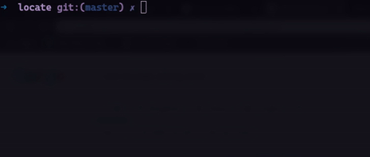

<p align="center">
    
    <br>
    
    
    
    
    
    
</p>
<p align="center">
    <a href="#key-features">Key Features</a> •
    <a href="#usage">Usage</a> •
    <a href="#give-it-a-test-run">Test Run</a> •
    <a href="#demo">Demo</a> •
    <a href="#installation">Installation</a> •
    <a href="#to-do">To-Do</a> •
    <a href="#license">License</a>
</p>

> A recursive Search Tool written in Rust

How many times have you gone through files in search of a string, or finding origin of a function.

Locate is a tool written in *Rust* which goes through each file and gives **exact location of the string** in the file.

---
## **Key Features**
- Works on **Windows**, **MacOS** and **Linux**
- Blazing **Fast**
  
  

- Finds String Deep Inside **Directory Structure**
  

---

## **Installation** 

``` bash
# Clone the repo
git clone https://github.com/pr4k/locate

# Build the project
cargo build --release

```
It will create a binary in `target/release`, copy it to `/usr/bin` and you are good to go.

Or simply do 

`cargo install locate`

---

## **Give it a Test Run**
Don't want to clone the project, *No worries!!* 

Go to the **releases** and downlaod the latest release, copy it to `/usr/bin` that's all.

---

## **Usage**

```bash
➜  ~ locate -h                       
Usage:
  locate [OPTIONS]

Recursive string locater in files

Optional arguments:
  -h,--help             Show this help message and exit
  -p,--path PATH        Path to folder
  -q,--query QUERY      Query string to find
```
Try `locate -p /path/to/folder -q /string-to-be-searched`

---

## **Demo**
<a href="https://asciinema.org/a/9uBSxwooJEGBLNZvoaW5zPPhF"></a>

Click on image to get a Asciinema shot:

---

## **TO-DO**

- Add **regex** support for the search string
- Control Folder depth for search
- Provide option to replace the searched word by another
  
## **License**
[](https://github.com/pr4k/locate)

- **[MIT license](http://opensource.org/licenses/mit-license.php)**
- Copyright 2020 © pr4k
---
